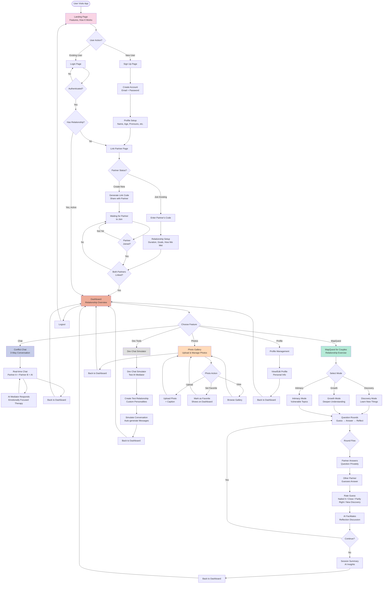
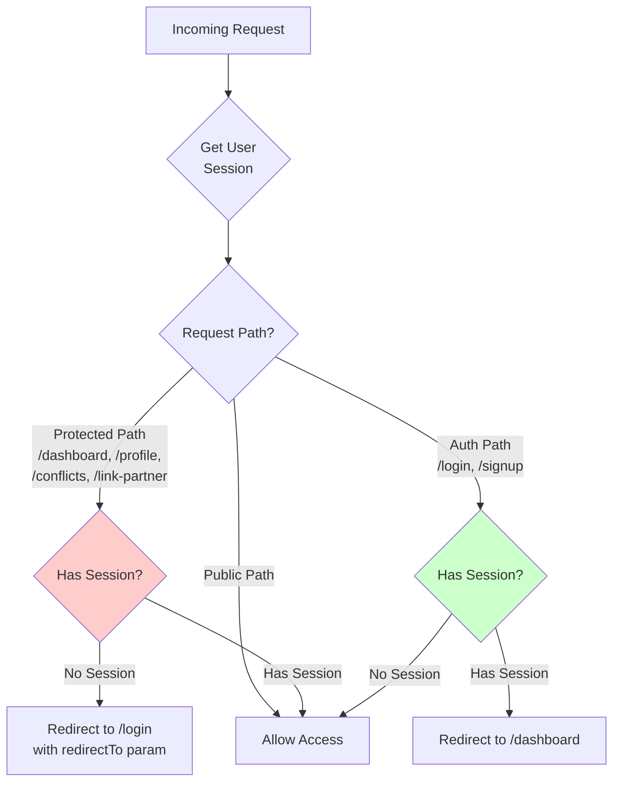
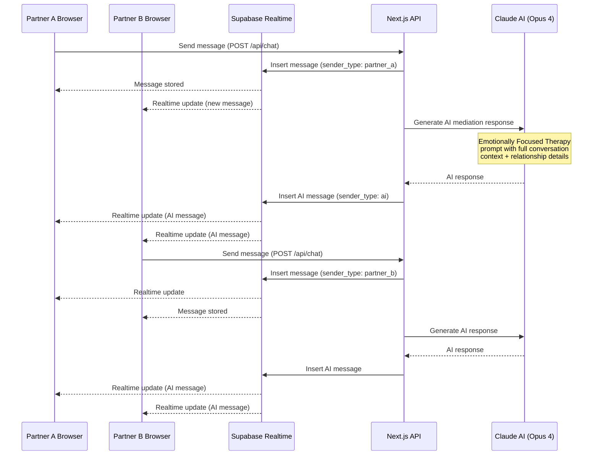
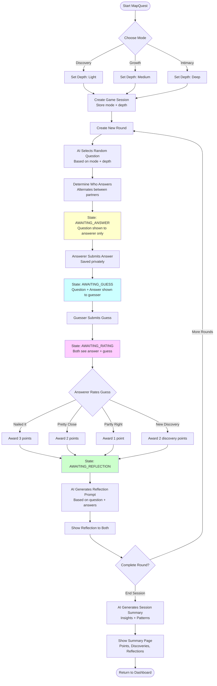
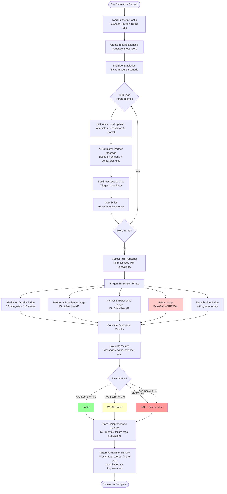
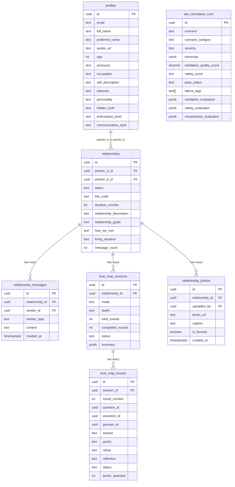

# Eros App Flow Chart

## Main Application Flow

## Middleware Logic Flow

## Chat Real-time Flow

## MapQuest Game Flow

## Dev Simulation Testing Flow

## Database Schema Overview

## Key Features Summary

| Feature | Status | Description |
|---------|--------|-------------|
| **Landing Page** | ✅ Live | Marketing page with features, how it works |
| **Authentication** | ✅ Live | Email/password signup and login via Supabase |
| **Profile Setup** | ✅ Live | Name, age, pronouns, occupation, interests |
| **Partner Linking** | ✅ Live | Generate/enter link code to connect partners |
| **Dashboard** | ✅ Live | Relationship overview, partner profiles, favorite photo |
| **Conflict Chat** | ✅ Live | 3-way real-time chat with AI mediator (EFT-based) |
| **MapQuest Game** | ✅ Live | Relationship exercise with 3 modes, 3 depths |
| **Photo Gallery** | ✅ Live | Upload, caption, favorite photos |
| **Dev Simulator** | ✅ Live | Test AI mediator with custom personalities |
| **Enhanced Testing** | ✅ Live | 5-agent evaluation system, 12 test scenarios |

## AI Integration Points

| Integration | Model | Purpose |
|-------------|-------|---------|
| **Conflict Mediator** | Claude Opus 4 | Emotionally Focused Therapy mediation in 3-way chat |
| **MapQuest Reflection** | Claude Opus 4 | Generate reflections after each round |
| **MapQuest Summary** | Claude Opus 4 | Session insights and pattern identification |
| **Partner Simulator** | Claude Opus 4 | Simulate realistic partner responses for testing |
| **Evaluation Judges** | Claude Opus 4 | 5 specialized judges for comprehensive evaluation |

## Current User Journey

1. **Landing** → Sign up → Create profile
2. **Link Partner** → Generate code OR enter partner's code
3. **Setup Relationship** → Duration, goals, how you met
4. **Wait for Partner** (if code creator) → Partner joins
5. **Dashboard** → See relationship overview
6. **Choose Feature:**
   - **Chat** → 3-way conversation with AI mediator
   - **MapQuest** → Guess-reveal-reflect game
   - **Photos** → Upload and manage couple photos
   - **Profile** → Edit personal information
7. **Return to Dashboard** → Access other features

## Notes

- All routes are protected by middleware (auth required)
- Real-time updates via Supabase Realtime subscriptions
- AI responses use full conversation context + relationship details
- Testing system evaluates safety (CRITICAL), quality, experience, and monetization
- All AI interactions use Claude Opus 4 for best quality
