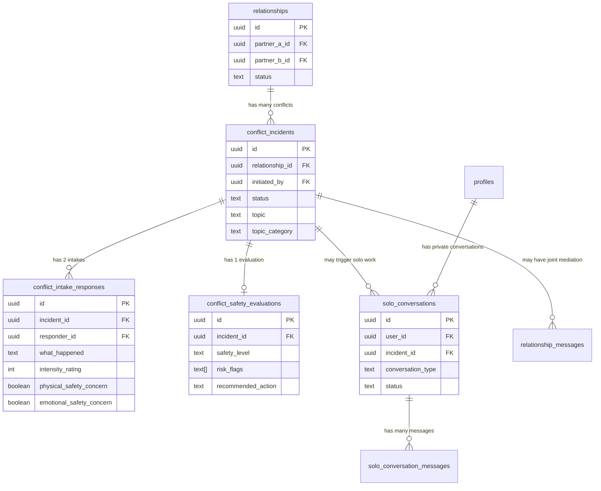
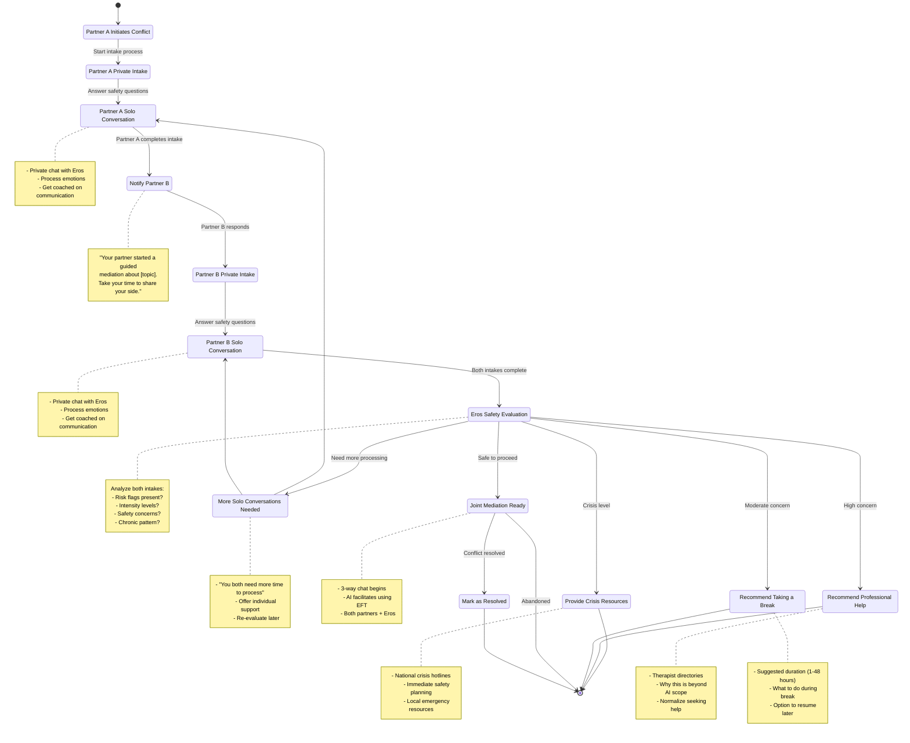

# Eros Mediation System - Technical Design

## Overview

This document outlines the technical architecture for Eros's core mediation system, focusing on:
1. **How Eros learns** from gathered data to become a better mediator
2. **New guided mediation flow** with private solo conversations and safety assessment
3. **Solo conversation feature** for ongoing support between conflicts

---

## Table of Contents

1. [Data Utilization Strategy](#data-utilization-strategy)
2. [Core Features](#core-features)
3. [Database Schema](#database-schema)
4. [Guided Mediation Flow](#guided-mediation-flow)
5. [Safety Evaluation Algorithm](#safety-evaluation-algorithm)
6. [API Design](#api-design)
7. [AI Prompting Strategy](#ai-prompting-strategy)
8. [Implementation Roadmap](#implementation-roadmap)

---

## Data Utilization Strategy

### How Eros Learns to Be a Better Mediator

Eros personalizes its mediation approach by gathering and utilizing data across three layers:

#### Layer 1: Baseline Relationship Context (Onboarding)
**Collected during signup flow:**
- **Intent** - What brings them here? (conflict, connection, learning, exploring)
- **Conflict patterns** - Types, frequency, escalation dynamics
- **Relationship strengths** - What's working well
- **Communication style** - How they typically handle disagreements
- **Relationship duration** - Context for expectations
- **Goals** - What success looks like to them

**How it's used:**
- Sets initial mediation tone (gentle for new couples, deeper for established)
- Identifies known triggers and patterns
- Tailors language to their stated goals
- Adjusts intervention intensity based on conflict frequency

**Example:**
```typescript
// Couple reports "We both get heated" + "Daily conflicts"
// Eros's mediation approach:
- More frequent de-escalation interventions
- Focus on cooling-down techniques
- Suggest breaks proactively
- Use calming language patterns
```

---

#### Layer 2: Conflict History (Ongoing Learning)
**Collected during each conflict incident:**
- **Structured safety assessment** (see below)
- **Individual narratives** - Each person's private account
- **Emotional intensity ratings** - Self-reported upset levels
- **Resolution outcomes** - What happened, was it resolved?
- **AI intervention effectiveness** - Did mediation help?

**How it's used:**
- **Pattern recognition** - "This is the 3rd time this month they've argued about chores"
- **Escalation prediction** - "Last 2 conflicts had intensity 8+, this is serious"
- **Personalized de-escalation** - "Partner A responds well to validation, Partner B needs space"
- **Topic mapping** - Build a conflict topic taxonomy for this couple
- **Effectiveness tracking** - Which interventions worked before?

**Example:**
```typescript
// Conflict history shows:
// - Topic: "Household chores" (5 incidents)
// - Pattern: Partner A feels unheard, Partner B withdraws
// - Successful interventions: Solo cool-down before joint session

// Eros adapts:
// - "I notice this topic has come up before. Last time, taking some space helped. Would that be useful now?"
// - Prompts Partner A to express needs, prompts Partner B to reflect before responding
```

---

#### Layer 3: Real-Time Conversation Context
**Collected during live mediation:**
- **Message sentiment analysis** - Detecting escalation in real-time
- **Turn-taking patterns** - Is one person dominating?
- **Response to AI prompts** - Are they engaging or resisting?
- **Time between messages** - Are they cooling down or spiraling?

**How it's used:**
- **Dynamic intervention** - Interrupt escalation before it peaks
- **Conversational balance** - "Partner B, I'd like to hear from you"
- **Adaptive pacing** - Speed up or slow down based on engagement
- **Safety monitoring** - Flag concerning language patterns

**Example:**
```typescript
// Real-time signals:
// - Partner A sends 4 messages in a row (dominating)
// - Partner B's last message had high negative sentiment
// - 30 seconds since last message (withdrawal?)

// Eros intervenes:
// - "Partner A, I can see you have a lot to express. Before we continue, let's make sure Partner B feels heard. Partner B, how are you feeling right now?"
```

---

### Data Flow Architecture

```
┌─────────────────────────────────────────────────────────┐
│                     EROS BRAIN                          │
│                                                         │
│  ┌─────────────────┐  ┌─────────────────┐              │
│  │  Relationship   │  │ Conflict History│              │
│  │  Profile        │  │  (Time-series)  │              │
│  │                 │  │                 │              │
│  │ • Intent        │  │ • Incidents     │              │
│  │ • Patterns      │  │ • Outcomes      │              │
│  │ • Goals         │  │ • Topics        │              │
│  │ • Duration      │  │ • Intensity     │              │
│  └────────┬────────┘  └────────┬────────┘              │
│           │                    │                        │
│           └──────────┬─────────┘                        │
│                      ▼                                  │
│           ┌──────────────────────┐                      │
│           │   AI Context Builder │                      │
│           │   (Prompt Assembly)  │                      │
│           └──────────┬───────────┘                      │
│                      ▼                                  │
│           ┌──────────────────────┐                      │
│           │  Claude Opus 4 API   │                      │
│           │  (EFT-based prompt)  │                      │
│           └──────────┬───────────┘                      │
│                      ▼                                  │
│           ┌──────────────────────┐                      │
│           │  Personalized        │                      │
│           │  Mediation Response  │                      │
│           └──────────────────────┘                      │
│                                                         │
└─────────────────────────────────────────────────────────┘
```

**Storage Strategy:**
- **PostgreSQL (Supabase)** - Structured data (incidents, assessments, profiles)
- **JSONB columns** - Flexible storage for evolving data (conflict details, AI insights)
- **Time-series queries** - Analyze patterns over time
- **Realtime triggers** - Update context when new data arrives

**Privacy & Ethics:**
- All data encrypted at rest
- Solo conversations NEVER shared with partner without consent
- Safety assessment data used ONLY for intervention decisions
- Users can request data deletion (GDPR compliance)
- No third-party data sharing

---

## Core Features

### 1. Guided Mediation (Primary Feature)
**Purpose:** Help couples resolve conflicts with AI-facilitated mediation

**User Journey:**
1. Partner A initiates → describes what happened privately
2. Structured safety questions asked to Partner A
3. Partner B notified → describes their side privately
4. Structured safety questions asked to Partner B
5. Eros evaluates → determines next steps
6. Outcome: Professional help, break, more solo work, or joint mediation

### 2. Solo Conversation (Support Feature)
**Purpose:** Individual emotional processing and guidance

**Use Cases:**
- Process emotions before talking to partner
- Get advice on how to approach a difficult conversation
- Reflect on recurring patterns
- Cool down after a conflict
- Practice what to say

**Key Principle:** Solo conversations are PRIVATE unless user chooses to share insights

### 3. Placeholder Features (De-prioritized for Now)
- MapQuest (relationship game) - keep as-is but not focus
- Photo gallery - keep as-is
- Dev tools - keep as-is

---

## Database Schema

### Modifications to Existing Tables

#### Update `profiles` table - Add conflict resolution preferences

```sql
-- Add columns to store user's conflict resolution preferences from onboarding
ALTER TABLE profiles
  ADD COLUMN conflict_resolution_preferences TEXT[] DEFAULT '{}';
  -- Populated from onboarding question: "How do you typically resolve conflicts best?"
  -- Options: 'talk_right_away', 'cool_down_first', 'need_space',
  --          'process_alone_first', 'write_first', 'sleep_on_it'

-- Example data:
-- User who selected "Take time to cool down first" and "Process alone then come together"
-- would have: ['cool_down_first', 'process_alone_first']
```

**Why this matters:**
Eros uses these preferences to personalize mediation recommendations. If both partners typically prefer "cool down first", Eros is more likely to recommend a break even if safety flags don't require it.

---

### New Tables

#### 1. `conflict_incidents` - Track each conflict event

```sql
CREATE TABLE conflict_incidents (
  id UUID PRIMARY KEY DEFAULT gen_random_uuid(),
  relationship_id UUID NOT NULL REFERENCES relationships(id) ON DELETE CASCADE,

  -- Initiation
  initiated_by UUID NOT NULL REFERENCES profiles(id),
  initiated_at TIMESTAMPTZ DEFAULT now(),

  -- Status tracking
  status TEXT NOT NULL DEFAULT 'awaiting_partner_intake'
    CHECK (status IN (
      'awaiting_partner_intake',    -- Partner A done, waiting for Partner B
      'safety_evaluation',           -- Both done, Eros evaluating
      'recommend_professional_help', -- Eros flagged as high-risk
      'recommend_break',             -- Eros suggests cooling off
      'solo_conversations',          -- Eros suggests more individual processing
      'joint_mediation_ready',       -- Ready for 3-way chat
      'in_joint_mediation',          -- Active 3-way conversation
      'resolved',                    -- Marked as resolved
      'abandoned'                    -- Users stopped engaging
    )),

  -- Topic & context
  topic TEXT,                        -- User-described topic (e.g., "finances", "chores")
  topic_category TEXT,               -- AI-classified category for pattern analysis

  -- Timeline
  partner_a_intake_completed_at TIMESTAMPTZ,
  partner_b_intake_completed_at TIMESTAMPTZ,
  joint_mediation_started_at TIMESTAMPTZ,
  resolved_at TIMESTAMPTZ,

  -- Outcome tracking
  resolution_outcome TEXT CHECK (resolution_outcome IN (
    'resolved_successfully',
    'still_working_on_it',
    'decided_to_take_break',
    'sought_professional_help',
    'unresolved'
  )),

  -- Metadata
  created_at TIMESTAMPTZ DEFAULT now(),
  updated_at TIMESTAMPTZ DEFAULT now()
);

CREATE INDEX idx_incidents_relationship ON conflict_incidents(relationship_id, created_at DESC);
CREATE INDEX idx_incidents_status ON conflict_incidents(status);
CREATE INDEX idx_incidents_topic_category ON conflict_incidents(topic_category);
```

---

#### 2. `conflict_intake_responses` - Private narratives from each person

```sql
CREATE TABLE conflict_intake_responses (
  id UUID PRIMARY KEY DEFAULT gen_random_uuid(),
  incident_id UUID NOT NULL REFERENCES conflict_incidents(id) ON DELETE CASCADE,
  responder_id UUID NOT NULL REFERENCES profiles(id),
  responder_role TEXT NOT NULL CHECK (responder_role IN ('partner_a', 'partner_b')),

  -- Free-form narrative
  what_happened TEXT NOT NULL,              -- "Tell me what happened from your perspective"

  -- Structured safety questions
  intensity_rating INTEGER NOT NULL CHECK (intensity_rating BETWEEN 1 AND 10),
    -- 1 = minor annoyance, 10 = explosive fight

  has_happened_before BOOLEAN NOT NULL,
  if_yes_how_often TEXT CHECK (if_yes_how_often IN (
    'first_time',
    'few_times_this_year',
    'monthly',
    'weekly',
    'daily',
    'constantly'
  )),

  current_emotional_state TEXT[] NOT NULL,  -- Array of emotions
    -- Options: angry, hurt, sad, frustrated, confused, scared,
    --          disappointed, betrayed, anxious, overwhelmed, numb

  physical_safety_concern BOOLEAN NOT NULL DEFAULT false,
    -- "Do you feel physically safe right now?"

  emotional_safety_concern BOOLEAN NOT NULL DEFAULT false,
    -- "Do you feel emotionally safe to talk about this?"

  need_immediate_break BOOLEAN NOT NULL DEFAULT false,
    -- "Do you need to take a break before continuing?"

  thoughts_of_ending_relationship BOOLEAN NOT NULL DEFAULT false,
    -- "Are you having thoughts about ending the relationship?"

  substance_involved BOOLEAN NOT NULL DEFAULT false,
    -- "Was alcohol or substance use involved in this conflict?"

  -- NEW: Urgency and readiness questions
  urgency_to_resolve INTEGER NOT NULL CHECK (urgency_to_resolve BETWEEN 1 AND 10),
    -- "How urgently do you feel you need to resolve this? 1 = can wait, 10 = need to talk now"

  how_triggered INTEGER NOT NULL CHECK (how_triggered BETWEEN 1 AND 10),
    -- "How triggered/activated do you feel right now? 1 = calm, 10 = extremely upset"

  preferred_next_step TEXT[] DEFAULT '{}',  -- Multi-select preferences
    -- Options: 'talk_now', 'take_break', 'process_alone_first', 'not_sure'

  -- Additional context
  what_you_need_right_now TEXT,             -- Free text: "What do you need right now?"
  anything_else TEXT,                       -- Open-ended

  -- Metadata
  created_at TIMESTAMPTZ DEFAULT now()
);

CREATE INDEX idx_intake_incident ON conflict_intake_responses(incident_id);
CREATE INDEX idx_intake_responder ON conflict_intake_responses(responder_id);

-- RLS: Users can only see their OWN intake responses (private)
ALTER TABLE conflict_intake_responses ENABLE ROW LEVEL SECURITY;

CREATE POLICY "Users can view their own intake responses"
  ON conflict_intake_responses FOR SELECT
  USING (responder_id = auth.uid());

CREATE POLICY "Users can create their own intake responses"
  ON conflict_intake_responses FOR INSERT
  WITH CHECK (responder_id = auth.uid());
```

---

#### 3. `conflict_safety_evaluations` - Eros's personalized recommendation

**Note:** This is now a RECOMMENDATION ENGINE, not just safety assessment. It considers:
- Safety flags (critical)
- User personality and preferences (from onboarding)
- Historical patterns (what's worked before)
- Current emotional state and urgency
- User's stated preferences for next step

```sql
CREATE TABLE conflict_safety_evaluations (
  id UUID PRIMARY KEY DEFAULT gen_random_uuid(),
  incident_id UUID NOT NULL REFERENCES conflict_incidents(id) ON DELETE CASCADE,

  -- Overall risk assessment
  safety_level TEXT NOT NULL CHECK (safety_level IN (
    'safe',              -- Normal conflict, proceed with mediation
    'moderate_concern',  -- Some yellow flags, proceed with caution
    'high_concern',      -- Red flags present, recommend professional help
    'crisis'             -- Immediate danger, provide crisis resources
  )),

  -- Specific risk flags
  risk_flags TEXT[] DEFAULT '{}',
    -- Possible values: 'physical_safety', 'emotional_abuse', 'substance_use',
    --                  'extreme_intensity', 'relationship_threat', 'chronic_pattern'

  -- PRIMARY RECOMMENDATION (based on safety + personality + history)
  primary_recommendation TEXT NOT NULL CHECK (primary_recommendation IN (
    'professional_help',     -- Refer to therapist
    'crisis_resources',      -- Provide crisis hotline info
    'take_break',            -- Suggest 24-48 hour cooling period
    'solo_conversations',    -- More individual processing needed
    'joint_mediation'        -- Safe to proceed with 3-way chat
  )),

  -- ALTERNATIVE OPTIONS (user can choose if they disagree with primary)
  alternative_options TEXT[] DEFAULT '{}',
    -- e.g., if primary is 'take_break', alternatives might be ['solo_conversations', 'joint_mediation']
    -- NEVER include options that violate safety (e.g., if crisis, no alternatives offered)

  -- Personalization factors considered
  personalization_factors JSONB NOT NULL,
    -- Explains WHY this recommendation was made, including:
    -- {
    --   "safety_factors": ["intensity both 8+", "chronic pattern"],
    --   "personality_factors": ["both prefer cool_down_first", "Partner A prefers process_alone_first"],
    --   "history_factors": ["last 3 conflicts resolved better after break"],
    --   "current_state_factors": ["both highly triggered (8+ / 10)", "urgency moderate (5/10)"],
    --   "user_preferences": ["Partner A wants talk_now", "Partner B wants take_break"]
    -- }

  -- AI's reasoning (natural language for users)
  evaluation_reasoning TEXT NOT NULL,
    -- User-friendly explanation: "I recommend taking a break because you're both
    -- feeling very triggered right now (8/10), and I've noticed you both typically
    -- resolve conflicts better after some cooling down time."

  -- If professional help recommended
  professional_help_resources JSONB,
    -- { "crisis_lines": [...], "therapist_directories": [...], "local_resources": [...] }

  -- If break recommended
  recommended_break_duration TEXT CHECK (recommended_break_duration IN (
    '1_hour', '4_hours', '12_hours', '24_hours', '48_hours', '1_week'
  )),

  -- Metadata
  evaluated_at TIMESTAMPTZ DEFAULT now(),
  model_version TEXT DEFAULT 'claude-opus-4-5-20251101'
);

CREATE INDEX idx_evaluation_incident ON conflict_safety_evaluations(incident_id);
CREATE INDEX idx_evaluation_safety_level ON conflict_safety_evaluations(safety_level);

-- Enable Realtime so users are notified of evaluation results
ALTER PUBLICATION supabase_realtime ADD TABLE conflict_safety_evaluations;
```

---

#### 4. `solo_conversations` - Private chats with Eros

```sql
CREATE TABLE solo_conversations (
  id UUID PRIMARY KEY DEFAULT gen_random_uuid(),
  user_id UUID NOT NULL REFERENCES profiles(id) ON DELETE CASCADE,
  relationship_id UUID NOT NULL REFERENCES relationships(id) ON DELETE CASCADE,

  -- Optional link to conflict incident
  incident_id UUID REFERENCES conflict_incidents(id) ON DELETE SET NULL,
    -- If this solo conversation is part of a guided mediation process

  -- Conversation type
  conversation_type TEXT NOT NULL CHECK (conversation_type IN (
    'conflict_processing',      -- Processing after/before a conflict
    'general_support',           -- General relationship advice
    'practice_conversation',     -- Practicing what to say
    'emotional_processing',      -- Just need to vent/process
    'reflection',                -- Reflecting on patterns
    'pre_conflict_preparation'   -- Preparing for a difficult conversation
  )),

  -- Status
  status TEXT DEFAULT 'active' CHECK (status IN ('active', 'completed', 'abandoned')),

  -- Metadata
  started_at TIMESTAMPTZ DEFAULT now(),
  last_message_at TIMESTAMPTZ DEFAULT now(),
  completed_at TIMESTAMPTZ
);

CREATE INDEX idx_solo_user ON solo_conversations(user_id, started_at DESC);
CREATE INDEX idx_solo_relationship ON solo_conversations(relationship_id);
CREATE INDEX idx_solo_incident ON solo_conversations(incident_id);

-- RLS: Users can only access their own solo conversations
ALTER TABLE solo_conversations ENABLE ROW LEVEL SECURITY;

CREATE POLICY "Users can view their own solo conversations"
  ON solo_conversations FOR SELECT
  USING (user_id = auth.uid());

CREATE POLICY "Users can create their own solo conversations"
  ON solo_conversations FOR INSERT
  WITH CHECK (user_id = auth.uid());
```

---

#### 5. `solo_conversation_messages` - Messages in solo chats

```sql
CREATE TABLE solo_conversation_messages (
  id UUID PRIMARY KEY DEFAULT gen_random_uuid(),
  conversation_id UUID NOT NULL REFERENCES solo_conversations(id) ON DELETE CASCADE,

  sender_type TEXT NOT NULL CHECK (sender_type IN ('user', 'ai')),
  content TEXT NOT NULL,

  -- AI metadata
  model_version TEXT,
  prompt_type TEXT,  -- e.g., 'empathetic_listening', 'conflict_coaching', 'reflection_prompt'

  created_at TIMESTAMPTZ DEFAULT now()
);

CREATE INDEX idx_solo_messages_conversation ON solo_conversation_messages(conversation_id, created_at ASC);

-- RLS: Users can only see messages from their own solo conversations
ALTER TABLE solo_conversation_messages ENABLE ROW LEVEL SECURITY;

CREATE POLICY "Users can view their own solo messages"
  ON solo_conversation_messages FOR SELECT
  USING (
    EXISTS (
      SELECT 1 FROM solo_conversations sc
      WHERE sc.id = conversation_id AND sc.user_id = auth.uid()
    )
  );

CREATE POLICY "Users can send messages in their own solo conversations"
  ON solo_conversation_messages FOR INSERT
  WITH CHECK (
    sender_type = 'user' AND
    EXISTS (
      SELECT 1 FROM solo_conversations sc
      WHERE sc.id = conversation_id AND sc.user_id = auth.uid()
    )
  );

-- Enable Realtime
ALTER PUBLICATION supabase_realtime ADD TABLE solo_conversation_messages;
```

---

#### 6. Modified `relationship_messages` - Joint mediation messages

```sql
-- Add incident_id to link messages to specific conflicts
ALTER TABLE relationship_messages
  ADD COLUMN incident_id UUID REFERENCES conflict_incidents(id) ON DELETE SET NULL;

CREATE INDEX idx_messages_incident ON relationship_messages(incident_id, created_at ASC);
```

---

### Data Relationships



---

## Guided Mediation Flow

### Overview

The guided mediation flow ensures both partners are heard individually before bringing them together, and prioritizes safety at every step.

### State Machine



---

### Detailed Step-by-Step Flow

#### Step 1: Partner A Initiates Conflict

**UI: Dashboard or dedicated "Start Mediation" button**

```
┌────────────────────────────────────────┐
│  Something's bothering you?            │
│  Let's work through it together.       │
│                                        │
│  [Start Guided Mediation]              │
└────────────────────────────────────────┘
```

**API Call:** `POST /api/mediation/initiate`

**Request:**
```json
{
  "relationship_id": "uuid"
}
```

**Response:**
```json
{
  "incident_id": "uuid",
  "status": "awaiting_partner_intake",
  "next_step": "partner_a_intake"
}
```

**Database:**
- Create `conflict_incidents` row with status `awaiting_partner_intake`

---

#### Step 2: Partner A Private Intake

**UI: Multi-step form with progress indicator**

**Question Flow:**

1. **What happened?** (Free text)
   ```
   Tell me what happened from your perspective.
   Take your time - this is private, just between you and me.

   [Text area]
   ```

2. **How intense was this?** (Scale 1-10)
   ```
   On a scale of 1-10, how intense was this conflict?
   1 = Minor annoyance    10 = Explosive fight

   [Slider: 1 ──────●──────── 10]
   ```

3. **Has this happened before?** (Yes/No → Frequency)
   ```
   Has this issue come up before?

   ○ Yes    ○ No

   [If Yes:]
   How often does this happen?
   ○ First time
   ○ A few times this year
   ○ About once a month
   ○ Weekly
   ○ Daily
   ○ Constantly
   ```

4. **How are you feeling right now?** (Multi-select emotions)
   ```
   Select all that apply:

   □ Angry          □ Hurt           □ Sad
   □ Frustrated     □ Confused       □ Scared
   □ Disappointed   □ Betrayed       □ Anxious
   □ Overwhelmed    □ Numb           □ Other
   ```

5. **Safety check: Physical** (Critical)
   ```
   Do you feel physically safe right now?

   ○ Yes, I feel physically safe
   ○ No, I have concerns about my physical safety

   [If No: Immediate crisis resources displayed]
   ```

6. **Safety check: Emotional** (Critical)
   ```
   Do you feel emotionally safe to talk about this?

   ○ Yes, I feel emotionally safe
   ○ No, I don't feel emotionally safe
   ○ I'm not sure
   ```

7. **Need a break?**
   ```
   Do you need to take a break before continuing?

   ○ No, I'm ready to continue
   ○ Yes, I need some time
   ```

8. **Relationship thoughts** (Critical)
   ```
   Are you having thoughts about ending the relationship?

   ○ No
   ○ Yes, occasionally
   ○ Yes, frequently
   ○ Yes, I'm seriously considering it
   ```

9. **Substance involvement** (Safety flag)
   ```
   Was alcohol or substance use involved in this conflict?

   ○ No
   ○ Yes
   ```

10. **How urgently do you need to resolve this?** (Urgency assessment)
    ```
    On a scale of 1-10, how urgently do you feel you need to resolve this?
    1 = Can wait, not pressing    10 = Need to talk about this right now

    [Slider: 1 ──────●──────── 10]
    ```

11. **How triggered are you right now?** (Emotional readiness)
    ```
    On a scale of 1-10, how triggered or activated do you feel right now?
    1 = Calm, grounded    10 = Extremely upset, can't think clearly

    [Slider: 1 ──────●──────── 10]
    ```

12. **What feels right for you next?** (User preference)
    ```
    What would feel most helpful for you right now? (Select all that apply)

    □ I want to talk about this together now
    □ I need to take a break first
    □ I want to process this alone before talking
    □ I'm not sure what I need

    (This won't lock you in - just helps me understand what feels right to you)
    ```

13. **What do you need right now?** (Free text)
    ```
    What do you need right now?
    (e.g., "I need them to listen", "I need space", "I need to feel heard")

    [Text area]
    ```

14. **Anything else?** (Optional)
    ```
    Is there anything else I should know?

    [Text area - optional]
    ```

**API Call:** `POST /api/mediation/incidents/[id]/intake`

**Request:**
```json
{
  "what_happened": "string",
  "intensity_rating": 7,
  "has_happened_before": true,
  "if_yes_how_often": "weekly",
  "current_emotional_state": ["frustrated", "hurt", "angry"],
  "physical_safety_concern": false,
  "emotional_safety_concern": false,
  "need_immediate_break": false,
  "thoughts_of_ending_relationship": false,
  "substance_involved": false,
  "urgency_to_resolve": 6,
  "how_triggered": 8,
  "preferred_next_step": ["process_alone_first", "take_break"],
  "what_you_need_right_now": "I need them to listen without getting defensive",
  "anything_else": null
}
```

**Database:**
- Create `conflict_intake_responses` row for Partner A
- Update `conflict_incidents` with `partner_a_intake_completed_at`

---

#### Step 3: Partner A Solo Conversation

**UI: Private chat interface with Eros**

**Purpose:**
- Give Partner A space to process emotions
- Coach them on effective communication
- De-escalate if needed
- Build empathy and understanding

**AI Prompt Strategy:**
```
You are Eros, an AI relationship mediator trained in Emotionally Focused Therapy.

CONTEXT:
- User: [Partner A name], [age], [pronouns]
- Partner: [Partner B name], [age], [pronouns]
- Relationship duration: [X months]
- Relationship goals: [from onboarding]
- Known conflict patterns: [from onboarding]

CURRENT SITUATION:
- Topic: [what_happened summary]
- Intensity: [rating]/10
- Emotions: [emotional_state array]
- Frequency: [if_yes_how_often]
- What they need: [what_you_need_right_now]

YOUR ROLE:
1. Validate their emotions (EFT: validation is key)
2. Help them identify underlying needs
3. Coach them on how to express needs without blame
4. Prepare them for productive conversation with partner
5. Assess if they're in a good state to proceed

TONE: Warm, empathetic, non-judgmental, like a wise friend

DO NOT:
- Take sides or assign blame
- Give advice they didn't ask for
- Rush them through processing
- Minimize their feelings

GOAL: Get them to a place where they can engage constructively with their partner.
```

**Example Conversation:**
```
Eros: "Thank you for sharing what happened. It sounds like you're feeling
       really frustrated and hurt, especially because this keeps coming up.
       That must be exhausting. Can you tell me more about what you need
       from [Partner B] in this situation?"

User: "I just need them to actually DO what they say they'll do. They say
       they'll help with chores and then I'm stuck doing everything."

Eros: "That makes sense. It sounds like the core issue is about feeling like
       you're carrying the load alone, and maybe not feeling like your partner
       follows through on their commitments. Is that right?"

User: "Exactly."

Eros: "When you talk to [Partner B] about this, how do those conversations
       usually go?"

User: "They get defensive and say I'm nagging."

Eros: "That sounds really frustrating. What if we practiced a way to share
       how you're feeling that focuses on your needs rather than their actions?
       For example, instead of 'You never help', something like 'I feel
       overwhelmed when I'm managing the house alone. I need us to share this
       responsibility.' How does that feel?"

User: "That's better... but I'm worried they'll still get defensive."

Eros: "That's a valid concern. When [Partner B] shares their side, are you
       ready to listen to their perspective too? They might have a different
       view of what's happening."

User: "Yeah, I guess I can try."

Eros: "Great. You're doing really well processing this. Before we bring
       [Partner B] into the conversation, I want to check: are you in a
       good headspace to have this conversation now, or would you benefit
       from taking a little more time?"

User: "I think I'm ready now."

Eros: "Wonderful. I'm going to invite [Partner B] to share their side
       privately with me first, just like you did. Once they're done, I'll
       evaluate whether we're ready for a conversation together or if more
       individual support would help. Sound good?"

User: "Yeah, okay."
```

**API:**
- Uses existing `POST /api/mediation/solo-chat` endpoint (see API Design section)
- Messages stored in `solo_conversation_messages`

---

#### Step 4: Notify Partner B

**UI: Push notification + in-app alert**

**Notification:**
```
┌────────────────────────────────────────┐
│  💬 Guided Mediation Request            │
│                                        │
│  [Partner A] has started a guided      │
│  mediation session about:              │
│                                        │
│  "[Topic]"                             │
│                                        │
│  They've shared their perspective      │
│  privately with me. Now I'd like to    │
│  hear from you.                        │
│                                        │
│  Take your time - there's no rush.     │
│                                        │
│  [Share Your Side]                     │
│  [I need more time]                    │
└────────────────────────────────────────┘
```

**API:**
- Real-time update via Supabase subscription
- Email/SMS notification (optional, based on user settings)

---

#### Step 5: Partner B Private Intake

**Same question flow as Partner A**, but personalized:

- "Your partner described the conflict as being about [topic]. Tell me what happened from your perspective."
- All safety questions asked again
- Stored as separate `conflict_intake_responses` row

**Database:**
- Update `conflict_incidents` with `partner_b_intake_completed_at`
- Status remains `awaiting_partner_intake` until solo conversation completes

---

#### Step 6: Partner B Solo Conversation

**Same private chat flow as Partner A**

**AI adapts based on:**
- Partner B's narrative (might be very different from Partner A's)
- Partner B's emotional state
- Relationship history and patterns
- What worked with Partner A

**Example if Partner B has different perspective:**
```
Eros: "Thank you for sharing your side. I can see this situation feels
       different from your perspective. You mentioned feeling criticized -
       can you tell me more about that?"

User: "Every time I don't do something perfectly, I get yelled at. I'm
       trying my best but it's never good enough."

Eros: "That sounds really painful, feeling like your efforts aren't being
       seen. What do you need from [Partner A] in these moments?"
```

---

#### Step 7: Safety Evaluation by Eros

**Triggered when both intakes complete**

**API Call:** Automatic background process
- `POST /api/mediation/incidents/[id]/evaluate`

**AI Evaluation Prompt:**
```
You are a safety evaluator for relationship conflicts. Analyze the following
intake data from both partners and determine the appropriate next steps.

PARTNER A INTAKE:
- Intensity: [rating]/10
- Frequency: [how_often]
- Emotions: [emotional_state]
- Physical safety concern: [boolean]
- Emotional safety concern: [boolean]
- Relationship thoughts: [boolean]
- Substance involved: [boolean]
- Narrative: [what_happened]

PARTNER B INTAKE:
- Intensity: [rating]/10
- Frequency: [how_often]
- Emotions: [emotional_state]
- Physical safety concern: [boolean]
- Emotional safety concern: [boolean]
- Relationship thoughts: [boolean]
- Substance involved: [boolean]
- Narrative: [what_happened]

EVALUATE:
1. Safety level: safe | moderate_concern | high_concern | crisis
2. Risk flags: (array of: physical_safety, emotional_abuse, substance_use,
                extreme_intensity, relationship_threat, chronic_pattern)
3. Recommended action: professional_help | crisis_resources | take_break |
                        solo_conversations | joint_mediation
4. Reasoning: (explain your assessment)

OUTPUT FORMAT (JSON):
{
  "safety_level": "string",
  "risk_flags": ["string"],
  "recommended_action": "string",
  "evaluation_reasoning": "string",
  "recommended_break_duration": "string | null",
  "professional_help_resources": {...} | null
}
```

**Decision Tree:**

```
IF any physical_safety_concern = true:
  → safety_level = "crisis"
  → recommended_action = "crisis_resources"

ELSE IF substance_involved = true AND intensity >= 7:
  → safety_level = "high_concern"
  → recommended_action = "professional_help"

ELSE IF thoughts_of_ending_relationship = true (either partner):
  → safety_level = "high_concern"
  → recommended_action = "professional_help"

ELSE IF both intensity >= 8:
  → safety_level = "moderate_concern"
  → recommended_action = "take_break"
  → recommended_break_duration = "24_hours"

ELSE IF chronic pattern (frequency = "daily" or "weekly") AND intensity >= 6:
  → safety_level = "moderate_concern"
  → recommended_action = "solo_conversations"

ELSE IF emotional_safety_concern = true (either partner):
  → safety_level = "moderate_concern"
  → recommended_action = "solo_conversations"

ELSE:
  → safety_level = "safe"
  → recommended_action = "joint_mediation"
```

**Database:**
- Create `conflict_safety_evaluations` row
- Update `conflict_incidents` status based on recommended_action

---

#### Step 8: Outcome Branches

##### Outcome A: Joint Mediation Ready ✅

**UI: Both partners notified with RECOMMENDATION + OPTIONS**
```
┌────────────────────────────────────────┐
│  ✅ My Recommendation: Talk Together    │
│                                        │
│  I've heard from both of you, and      │
│  based on what you've shared, I think  │
│  you're ready to talk together.        │
│                                        │
│  Why I'm recommending this:            │
│  • You're both feeling calm enough     │
│    (triggered level: 4/10 and 5/10)    │
│  • You both want to talk it through    │
│  • This topic hasn't escalated before  │
│                                        │
│  ┌──────────────────────────────────┐  │
│  │  [Start 3-Way Conversation] ✨    │  │
│  │  Recommended                      │  │
│  └──────────────────────────────────┘  │
│                                        │
│  Or, if you prefer:                    │
│  [Take a break first]                  │
│  [Talk to me privately more]           │
│                                        │
│  You're in control - choose what       │
│  feels right for you.                  │
└────────────────────────────────────────┘
```

**Flow:**
- Show primary recommendation prominently
- Explain reasoning transparently
- Offer alternative options (if safe to do so)
- User CHOOSES next step - not forced
- If they choose joint mediation:
  - Redirect to 3-way chat interface
  - Eros opens with: "Thank you both for taking the time to share your perspectives with me. Let's work through this together. [Partner A], would you like to start by sharing how you're feeling?"
  - Standard EFT-based mediation continues
  - Messages linked to `incident_id`

---

##### Outcome B: Take a Break 🕒

**UI: Both partners notified with RECOMMENDATION + OPTIONS**
```
┌────────────────────────────────────────┐
│  🕒 My Recommendation: Take a Break     │
│                                        │
│  Based on what you've both shared, I   │
│  think it would be helpful to take a   │
│  break before talking together.        │
│                                        │
│  Why I'm recommending this:            │
│  • You're both pretty triggered right  │
│    now (8/10 and 7/10)                 │
│  • You both typically resolve better   │
│    after cooling down                  │
│  • This gives you time to process      │
│                                        │
│  ┌──────────────────────────────────┐  │
│  │  [Take a 24-hour break] ✨        │  │
│  │  Recommended                      │  │
│  └──────────────────────────────────┘  │
│                                        │
│  Or, if you prefer:                    │
│  [Talk to me privately more]           │
│  [Try talking together anyway]         │
│                                        │
│  During a break:                       │
│  • Give each other space               │
│  • You can chat with me privately      │
│  • I'll check in with you tomorrow     │
└────────────────────────────────────────┘
```

**Follow-up:**
- If they choose break: Scheduled notification after break period
- Option to extend break
- Option to start solo conversations during break
- User can override and choose joint mediation if they want (we trust them)

---

##### Outcome C: More Solo Conversations Needed 💭

**UI: Both partners notified separately with RECOMMENDATION + OPTIONS**
```
┌────────────────────────────────────────┐
│  💭 My Recommendation: Process More     │
│                                        │
│  After hearing from both of you, I     │
│  think you each need a bit more time   │
│  to process this individually before   │
│  talking together.                     │
│                                        │
│  Why I'm recommending this:            │
│  • Your perspectives are very different│
│  • You're both feeling defensive       │
│  • More solo work can help you build   │
│    empathy for each other              │
│                                        │
│  ┌──────────────────────────────────┐  │
│  │  [Continue private chat] ✨       │  │
│  │  Recommended                      │  │
│  └──────────────────────────────────┘  │
│                                        │
│  Or, if you prefer:                    │
│  [Take a break to think]               │
│  [Try talking together now]            │
│                                        │
│  This isn't a setback - it's setting   │
│  you up for success.                   │
└────────────────────────────────────────┘
```

**Flow:**
- If they choose solo work:
  - Re-open solo conversation for each partner
  - AI works with each person to:
    - Process emotions further
    - Build empathy for partner's perspective
    - Practice de-escalation techniques
    - Identify underlying needs
  - Re-evaluate when both are ready
- User can choose alternatives if they prefer

---

##### Outcome D: Professional Help Recommended 🏥

**UI: Both partners notified with STRONG RECOMMENDATION + LIMITED OPTIONS**
```
┌────────────────────────────────────────┐
│  🏥 My Recommendation: Professional Help│
│                                        │
│  Based on what you've both shared,     │
│  I think this situation would benefit  │
│  from professional support beyond what │
│  I can provide.                        │
│                                        │
│  Why I'm recommending this:            │
│  • This conflict has been ongoing for  │
│    months without resolution           │
│  • You're both considering ending the  │
│    relationship                        │
│  • The intensity is consistently high  │
│                                        │
│  This is not a failure - it means you  │
│  care enough to get the right help.    │
│                                        │
│  ┌──────────────────────────────────┐  │
│  │  [Find a Therapist] ✨            │  │
│  │  Strongly Recommended             │  │
│  └──────────────────────────────────┘  │
│                                        │
│  📞 National Hotlines:                 │
│  • Couples Therapy: 1-800-XXX-XXXX     │
│  • Crisis Support: 1-800-XXX-XXXX      │
│                                        │
│  🔍 Find a Therapist:                  │
│  • Psychology Today                    │
│  • BetterHelp                          │
│  • Local counseling centers            │
│                                        │
│  I'll still be here if you need me:    │
│  [Talk to Eros privately]              │
│  [Take a break for now]                │
└────────────────────────────────────────┘
```

**Resources provided:**
- Crisis hotlines (24/7 support)
- Therapist directories (Psychology Today, BetterHelp)
- EFT therapist locator
- Local resources based on location (if available)
- Educational content about when to seek help

**Note:** Joint mediation NOT offered as alternative when professional help recommended for safety reasons

---

##### Outcome E: Crisis Resources 🚨

**UI: Immediate display (highest priority)**
```
┌────────────────────────────────────────┐
│  🚨 Immediate Support Available         │
│                                        │
│  Your safety is the top priority.      │
│                                        │
│  📞 Crisis Hotlines (24/7):            │
│                                        │
│  National Domestic Violence Hotline:   │
│  1-800-799-7233                        │
│  Text "START" to 88788                 │
│                                        │
│  National Suicide Prevention:          │
│  988                                   │
│                                        │
│  Crisis Text Line:                     │
│  Text "HELLO" to 741741                │
│                                        │
│  🆘 Emergency: Call 911                 │
│                                        │
│  These services are:                   │
│  • Free and confidential               │
│  • Available 24/7                      │
│  • Staffed by trained counselors       │
│                                        │
│  [Call Now]                            │
│  [Create Safety Plan]                  │
└────────────────────────────────────────┘
```

**Additional actions:**
- Incident marked as `recommend_professional_help`
- Future mediation attempts blocked until safety plan created
- Option to create personalized safety plan with Eros

---

## Personalized Recommendation Algorithm

**Important:** This is now a **recommendation engine**, not just safety assessment. It generates:
1. **Primary recommendation** based on safety + personality + history
2. **Alternative options** (if safe to offer)
3. **Transparent reasoning** explaining the recommendation

### Step 1: Safety Assessment (Non-negotiable baseline)

**Critical Red Flags (Immediate Crisis):**
- Physical safety concern reported by either partner → CRISIS
- Mentions of violence or threats → CRISIS
- Current substance use + high intensity → HIGH CONCERN

**Major Yellow Flags (Professional Help):**
- Thoughts of ending relationship (frequent) → HIGH CONCERN
- Chronic pattern (daily/weekly) + high intensity (7+) → HIGH CONCERN
- Emotional safety concerns + extreme emotions → HIGH CONCERN
- Both partners rate intensity 9-10 → HIGH CONCERN

**Moderate Yellow Flags (May suggest Break or Solo Work):**
- Both partners rate intensity 7-8
- Emotional safety concerns without extreme intensity
- Chronic pattern (weekly) + moderate intensity (5-6)
- Conflicting narratives with blame language

**Green Flags (Safe for Joint Mediation):**
- No safety concerns
- Intensity < 7 for both
- Both emotionally ready
- Clear needs expressed
- Willingness to listen

### Step 2: Personalization Layer (If safe, consider preferences)

**Personality Factors (from onboarding):**
- **Both prefer "cool_down_first"** → Lean toward recommending break
- **Both prefer "talk_right_away"** → Lean toward recommending joint mediation
- **Both prefer "process_alone_first"** → Lean toward recommending solo conversations
- **Preferences conflict** → Consider current state and urgency

**Current State Factors (from intake):**
- **Both have high urgency (8+)** → Lean toward faster resolution (joint mediation or solo)
- **Both highly triggered (8+)** → Lean toward break or solo work first
- **User preferences stated** → Weight these heavily in alternatives
  - If Partner A wants "talk_now" and Partner B wants "take_break" → Offer both as options

**Historical Factors (from past conflicts):**
- **Last 3 conflicts resolved better after breaks** → Recommend break
- **Past solo conversations led to successful mediation** → Recommend solo work
- **Joint mediation worked well before** → Recommend joint mediation

### Step 3: Generate Recommendation + Alternatives

**Decision Matrix:**

| Safety Level | Personality Match | Current State | Urgency | → Primary Recommendation | Alternatives Offered |
|--------------|------------------|---------------|---------|------------------------|---------------------|
| Safe | Both "talk_right_away" | Low triggered | High urgency | Joint Mediation | Solo work, Break |
| Safe | Both "cool_down_first" | High triggered | Moderate urgency | Take Break | Solo work, Joint mediation |
| Safe | Both "process_alone_first" | Moderate triggered | Low urgency | Solo Conversations | Take break, Joint mediation |
| Moderate concern | Mixed preferences | High triggered | Low urgency | Take Break | Solo work only |
| High concern | Any | Any | Any | Professional Help | Solo work, Take break (NO joint mediation) |
| Crisis | Any | Any | Any | Crisis Resources | NONE (safety emergency) |

**Always respect user autonomy:**
- Users can choose alternatives if they disagree with primary recommendation
- Exception: NEVER offer joint mediation as alternative when professional help/crisis recommended

### Pattern Recognition

**Database queries to inform evaluation:**

```sql
-- Check conflict frequency for this couple
SELECT COUNT(*) as conflict_count,
       AVG((SELECT intensity_rating FROM conflict_intake_responses
            WHERE incident_id = conflict_incidents.id LIMIT 1)) as avg_intensity
FROM conflict_incidents
WHERE relationship_id = $1
  AND created_at > NOW() - INTERVAL '30 days';

-- Check if this topic has come up before
SELECT COUNT(*) as topic_recurrence
FROM conflict_incidents
WHERE relationship_id = $1
  AND topic_category = $2
  AND created_at > NOW() - INTERVAL '90 days';

-- Check previous safety concerns
SELECT COUNT(*) as safety_concern_count
FROM conflict_safety_evaluations cse
JOIN conflict_incidents ci ON cse.incident_id = ci.id
WHERE ci.relationship_id = $1
  AND cse.safety_level IN ('high_concern', 'crisis')
  AND cse.evaluated_at > NOW() - INTERVAL '60 days';
```

**If pattern detected:**
- "I notice this is the 4th time you've both brought up [topic] this month. This suggests a deeper pattern that might benefit from professional support."

---

## API Design

### Mediation Endpoints

#### 1. Initiate Conflict

**POST /api/mediation/initiate**

**Request:**
```json
{
  "relationship_id": "uuid"
}
```

**Response:**
```json
{
  "incident_id": "uuid",
  "status": "awaiting_partner_intake",
  "next_step": "partner_a_intake"
}
```

---

#### 2. Submit Intake Response

**POST /api/mediation/incidents/[incident_id]/intake**

**Request:**
```json
{
  "what_happened": "string",
  "intensity_rating": 1-10,
  "has_happened_before": boolean,
  "if_yes_how_often": "string",
  "current_emotional_state": ["string"],
  "physical_safety_concern": boolean,
  "emotional_safety_concern": boolean,
  "need_immediate_break": boolean,
  "thoughts_of_ending_relationship": boolean,
  "substance_involved": boolean,
  "what_you_need_right_now": "string",
  "anything_else": "string | null"
}
```

**Response:**
```json
{
  "intake_id": "uuid",
  "next_step": "solo_conversation",
  "solo_conversation_id": "uuid"
}
```

**Logic:**
- Create `conflict_intake_responses` row
- Create `solo_conversations` row linked to incident
- If Partner B and their intake is complete, trigger safety evaluation

---

#### 3. Solo Conversation - Send Message

**POST /api/mediation/solo/[conversation_id]/messages**

**Request:**
```json
{
  "content": "string"
}
```

**Response:**
```json
{
  "user_message": {
    "id": "uuid",
    "content": "string",
    "created_at": "timestamp"
  },
  "ai_response": {
    "id": "uuid",
    "content": "string",
    "created_at": "timestamp"
  }
}
```

**Logic:**
- Store user message
- Build AI context from:
  - Solo conversation history
  - Intake responses
  - Relationship profile
  - Conflict history
- Call Claude Opus 4
- Store AI response
- Return both messages

---

#### 4. Get Safety Evaluation

**GET /api/mediation/incidents/[incident_id]/evaluation**

**Response:**
```json
{
  "safety_level": "safe | moderate_concern | high_concern | crisis",
  "risk_flags": ["string"],
  "recommended_action": "string",
  "evaluation_reasoning": "string",
  "recommended_break_duration": "string | null",
  "professional_help_resources": {...} | null
}
```

---

#### 5. Mark Incident Resolved

**POST /api/mediation/incidents/[incident_id]/resolve**

**Request:**
```json
{
  "resolution_outcome": "resolved_successfully | still_working_on_it | decided_to_take_break | sought_professional_help | unresolved"
}
```

**Response:**
```json
{
  "success": true
}
```

---

#### 6. Get Conflict History

**GET /api/mediation/history**

**Query params:**
- `relationship_id` (required)
- `limit` (optional, default 10)
- `offset` (optional, default 0)

**Response:**
```json
{
  "incidents": [
    {
      "id": "uuid",
      "topic": "string",
      "topic_category": "string",
      "status": "string",
      "initiated_at": "timestamp",
      "resolved_at": "timestamp | null",
      "resolution_outcome": "string | null",
      "safety_level": "string"
    }
  ],
  "total_count": 42
}
```

---

### Solo Conversation Endpoints

#### 1. Start Solo Conversation

**POST /api/solo/start**

**Request:**
```json
{
  "relationship_id": "uuid",
  "conversation_type": "conflict_processing | general_support | practice_conversation | emotional_processing | reflection | pre_conflict_preparation",
  "incident_id": "uuid | null"  // Optional link to conflict
}
```

**Response:**
```json
{
  "conversation_id": "uuid",
  "opening_message": {
    "id": "uuid",
    "content": "Hi [name], I'm here to listen. What's on your mind?",
    "created_at": "timestamp"
  }
}
```

---

#### 2. Send Message in Solo Conversation

**Same as mediation solo endpoint above**

---

#### 3. Get Solo Conversation History

**GET /api/solo/conversations**

**Query params:**
- `limit` (optional)
- `offset` (optional)
- `status` (optional filter)

**Response:**
```json
{
  "conversations": [
    {
      "id": "uuid",
      "conversation_type": "string",
      "status": "string",
      "started_at": "timestamp",
      "last_message_at": "timestamp",
      "message_count": 12
    }
  ]
}
```

---

## AI Prompting Strategy

### Context Assembly for Mediation

Every AI call includes:

```typescript
interface MediationContext {
  // Relationship baseline
  relationship: {
    duration_months: number;
    goals: string[];
    strengths: string[];
    known_patterns: {
      conflict_types: string[];
      conflict_frequency: string;
      typical_escalation: string[];
    };
  };

  // Partners
  partners: {
    partner_a: {
      name: string;
      age: number;
      pronouns: string;
      communication_style?: string;
    };
    partner_b: {
      // same structure
    };
  };

  // Current conflict
  current_incident: {
    topic: string;
    initiated_by: 'partner_a' | 'partner_b';

    partner_a_intake: {
      what_happened: string;
      intensity: number;
      emotions: string[];
      needs: string;
      // ... all intake fields
    };

    partner_b_intake: {
      // same structure if available
    };
  };

  // Conflict history
  past_conflicts: {
    total_count_30_days: number;
    recurring_topics: string[];
    avg_intensity: number;
    typical_resolution: string;
  };

  // Solo conversation history (if applicable)
  solo_messages?: Message[];
}
```

### Prompt Templates

#### Solo Conversation (Conflict Processing)

```
SYSTEM ROLE:
You are Eros, an AI relationship mediator trained in Emotionally Focused Therapy (EFT).
You are currently in a PRIVATE conversation with [User Name]. Their partner CANNOT see this conversation.

CONTEXT:
{relationship context}
{current incident context}
{conflict history}

CURRENT SOLO CONVERSATION:
{previous messages in this solo conversation}

YOUR GOALS:
1. Validate [User Name]'s emotions without judgment
2. Help them identify their underlying attachment needs (EFT framework)
3. Coach them on expressing needs using "I feel... I need..." statements
4. Build empathy for their partner's potential perspective
5. Assess their readiness for joint conversation

EFT PRINCIPLES:
- Emotions are signals about attachment needs
- Focus on "primary emotions" (hurt, fear, sadness) beneath "secondary emotions" (anger, frustration)
- Reframe conflicts as "protest dances" - both partners are trying to get needs met
- Explore the cycle: Partner A does X → Partner B feels Y → Partner B does Z → Partner A feels hurt → repeat

TONE:
Warm, empathetic, gentle, non-judgmental. Like a wise therapist who truly cares.

CONSTRAINTS:
- NEVER blame or side against the partner
- NEVER give advice unless explicitly asked
- NEVER rush them - let them process at their own pace
- If they express safety concerns, prioritize that immediately

RESPONSE:
Generate your next message to [User Name].
```

#### Joint Mediation

```
SYSTEM ROLE:
You are Eros, an AI relationship mediator facilitating a 3-way conversation between
[Partner A Name] and [Partner B Name] using Emotionally Focused Therapy (EFT).

CONTEXT:
{relationship context}
{current incident context - BOTH intakes}
{conflict history}
{safety evaluation - confirmed SAFE for joint mediation}

MEDIATION HISTORY:
{previous messages in this 3-way chat}

YOUR GOALS:
1. Create a safe, balanced space for both partners
2. Help each partner feel heard and understood
3. Identify the underlying attachment needs driving the conflict
4. Interrupt blame cycles and reframe to needs
5. Facilitate repair and reconnection

EFT MEDIATION TECHNIQUES:
- **Slow down escalation**: "Let's pause for a moment. [Partner A], I hear you're feeling
  frustrated. Can you help me understand what's underneath that frustration?"

- **Reflect and validate**: "[Partner B], it sounds like you're feeling criticized and that
  makes you want to withdraw. Is that right?"

- **Reframe to attachment needs**: "It seems like [Partner A] is saying 'I need to feel
  like we're a team,' and [Partner B] is saying 'I need to feel accepted as I am.' Both
  of those needs make sense."

- **Highlight positive intent**: "Even though this is hard, the fact that you're both
  here shows you care about making this work."

CONVERSATION BALANCE:
- Current message count: Partner A: {count}, Partner B: {count}
- If imbalanced, gently invite the quieter partner to share

SAFETY MONITORING:
- Watch for: blame language, contempt, stonewalling, personal attacks
- If detected, interrupt gently: "I want to make sure we stay respectful. [Partner],
  can you share how you're feeling without using 'you always' or 'you never'?"

RESPONSE:
Generate your next mediation message addressing both [Partner A Name] and [Partner B Name].
```

#### Safety Evaluation

```
SYSTEM ROLE:
You are a safety evaluator for relationship conflicts. Analyze intake data from both
partners and determine if it's safe to proceed with AI-mediated conversation.

PARTNER A INTAKE:
{all intake fields}

PARTNER B INTAKE:
{all intake fields}

CONFLICT HISTORY:
{past 30 days: count, avg intensity, safety concerns}

EVALUATION CRITERIA:

🚨 CRISIS (immediate crisis resources):
- Physical safety concerns reported
- Mentions of violence, threats, or harm
- Active substance use + high intensity

⚠️ HIGH CONCERN (professional help):
- Frequent thoughts of ending relationship
- Chronic high-intensity pattern (weekly 7+ intensity)
- Emotional abuse indicators
- Extreme emotional distress (suicidal ideation)

⚠️ MODERATE CONCERN (break or solo work):
- Both intensity 7-8 (needs cooling off → break)
- Emotional safety concerns (needs processing → solo)
- Chronic moderate pattern (weekly 5-6 → solo)

✅ SAFE (proceed to joint mediation):
- No major safety flags
- Intensity < 7
- Both emotionally ready

OUTPUT FORMAT (JSON):
{
  "safety_level": "crisis | high_concern | moderate_concern | safe",
  "risk_flags": ["array of specific flags"],
  "recommended_action": "crisis_resources | professional_help | take_break | solo_conversations | joint_mediation",
  "evaluation_reasoning": "2-3 sentences explaining your decision",
  "recommended_break_duration": "24_hours | 48_hours | null",
  "professional_help_resources": {
    "crisis_lines": [...],
    "therapist_directories": [...],
    "why_professional_help": "explanation"
  } | null
}

Be conservative with safety. When in doubt, recommend a higher level of support.
```

---

## Implementation Roadmap

### Phase 1: Database & Core Infrastructure (Week 1)
- [ ] Create migration with new tables
- [ ] Set up RLS policies
- [ ] Enable Realtime on new tables
- [ ] Test data flow

### Phase 2: Guided Mediation Backend (Week 2)
- [ ] Build API endpoints for incident lifecycle
- [ ] Implement intake flow
- [ ] Build solo conversation API
- [ ] Implement safety evaluation algorithm
- [ ] Test with mock data

### Phase 3: AI Integration (Week 3)
- [ ] Create prompt templates
- [ ] Build context assembly system
- [ ] Implement Claude Opus 4 calls for solo conversations
- [ ] Implement safety evaluation AI
- [ ] Implement joint mediation AI
- [ ] Test AI responses for quality

### Phase 4: Frontend - Initiation & Intake (Week 4)
- [ ] Build "Start Mediation" UI
- [ ] Build multi-step intake form
- [ ] Add progress indicators
- [ ] Implement safety question flow
- [ ] Add validation and error handling

### Phase 5: Frontend - Solo Conversations (Week 5)
- [ ] Build solo chat interface
- [ ] Add real-time message updates
- [ ] Implement "partner notified" screens
- [ ] Add emotional check-ins during chat

### Phase 6: Frontend - Safety Outcomes (Week 6)
- [ ] Build outcome screens (crisis, professional help, break, solo, joint)
- [ ] Add crisis resources display
- [ ] Implement break timer/reminders
- [ ] Build professional help resource directory

### Phase 7: Frontend - Joint Mediation (Week 7)
- [ ] Update 3-way chat to link to incidents
- [ ] Add mediation-specific UI elements
- [ ] Implement resolution flow
- [ ] Add feedback collection

### Phase 8: Analytics & Learning (Week 8)
- [ ] Build conflict history dashboard
- [ ] Implement pattern recognition queries
- [ ] Add AI effectiveness tracking
- [ ] Create admin analytics panel

### Phase 9: Testing & Refinement (Week 9-10)
- [ ] User testing with real couples
- [ ] Refine AI prompts based on feedback
- [ ] Adjust safety evaluation thresholds
- [ ] Polish UI/UX
- [ ] Fix bugs

### Phase 10: Launch Preparation (Week 11-12)
- [ ] Security audit
- [ ] Performance optimization
- [ ] Documentation
- [ ] Crisis resource verification
- [ ] Legal review (terms, privacy, disclaimers)
- [ ] Soft launch with beta users

---

## Success Metrics

### Safety Metrics (Most Important)
- % of conflicts flagged as high concern or crisis
- False positive rate (users seeking professional help when not needed)
- False negative rate (dangerous situations not caught)
- User reports of feeling unsafe during mediation

### Engagement Metrics
- % of initiated conflicts that complete intake (both partners)
- % of intakes that lead to joint mediation
- % of mediations marked as "resolved successfully"
- Average messages per solo conversation
- Average time from initiation to resolution

### Learning Metrics
- Recurrence rate of same topics
- Intensity trending (are conflicts getting less intense over time?)
- Pattern recognition accuracy (does AI correctly identify patterns?)
- Intervention effectiveness (do AI suggestions help?)

### User Satisfaction
- Post-mediation satisfaction rating
- "Did you feel heard?" (both partners)
- "Was this helpful?" (binary)
- Net Promoter Score (NPS)

---

## Ethical Considerations

### Transparency
- Always disclose AI limitations
- Clear about when professional help is needed
- Explain how data is used

### Privacy
- Solo conversations are PRIVATE by default
- No sharing between partners without explicit consent
- Data encryption and security

### Safety
- Conservative safety evaluation (err on side of caution)
- Always provide crisis resources
- Never position AI as replacement for therapy

### Bias & Fairness
- Monitor for gender bias in mediation
- Ensure balanced turn-taking
- Avoid cultural assumptions
- Regular prompt audits

---

## Future Enhancements

### Phase 2 Features
- **Couples therapy finder integration** - Direct referrals with booking
- **Check-in system** - Proactive "How are things going?" after conflicts
- **Conflict patterns dashboard** - Visual analytics for couples
- **Shared insights** - Option to share solo conversation insights with partner
- **Voice integration** - Voice-to-text for accessibility
- **Multi-language support** - Serve non-English speaking couples

### Advanced AI Features
- **Predictive conflict detection** - "I notice tension building, want to talk?"
- **Personalized de-escalation strategies** - Learn what works for each couple
- **Long-term pattern analysis** - Quarterly relationship health reports
- **Integration with calendar/schedule** - Suggest good times to talk based on stress patterns

---

*This technical design prioritizes safety, privacy, and personalization to create a truly helpful relationship mediation system powered by AI while recognizing its limitations.*
