# Proposed Enhanced Onboarding Flow for Eros

## Philosophy

**Current Problem:** Too much information requested upfront, no immediate value, partner linking friction.

**New Approach:**
- ✅ Minimal friction signup
- ✅ Show value early (quick win)
- ✅ Progressive disclosure (ask for info when needed)
- ✅ Provide solo value while waiting for partner
- ✅ Gamified milestones
- ✅ Guided first experience

---

## Proposed Onboarding Flow

```mermaid
flowchart TD
    Start([User Visits Eros]) --> Landing[Landing Page<br/>See Features & Value Prop]

    Landing --> SignupChoice{Action?}
    SignupChoice -->|Get Started| Signup[Quick Signup<br/>Email + Password ONLY<br/>30 seconds]
    SignupChoice -->|Learn More| Demo[Watch Demo Video<br/>or Try Preview]

    Demo --> SignupChoice

    Signup --> Welcome[Welcome Screen<br/>'Hi! Let's get you started'<br/>Progress: 1/5]

    Welcome --> BasicInfo[Step 1: Basic Info<br/>Just your name<br/>Progress: 2/5]

    BasicInfo --> Intent{Step 2: What brings you here?<br/>Progress: 3/5}

    Intent -->|Work on conflict| ConflictFollowup
    Intent -->|Deepen connection| ConnectionFollowup
    Intent -->|Learn about partner| LearnFollowup
    Intent -->|Just exploring| ExploreFollowup

    ConflictFollowup[Great! Let's understand<br/>your conflict patterns]
    ConflictFollowup --> ConflictQ1{What types of conflicts<br/>come up most often?<br/>OPTIONAL - Can skip all}

    ConflictQ1 -->|Answer| ConflictType[Select all that apply:<br/>□ Daily frustrations<br/>□ Big disagreements<br/>□ Same issues repeatedly<br/>□ Communication breakdown<br/>□ Other]
    ConflictQ1 -->|Skip| InvitePartner

    ConflictType --> ConflictQ2{How often do conflicts happen?<br/>OPTIONAL}

    ConflictQ2 -->|Answer| ConflictFreq[○ Daily<br/>○ Few times a week<br/>○ Weekly<br/>○ Few times a month<br/>○ Rarely]
    ConflictQ2 -->|Skip| InvitePartner

    ConflictFreq --> ConflictQ3{When you disagree,<br/>what usually happens?<br/>OPTIONAL}

    ConflictQ3 -->|Answer| ConflictPattern[○ We both get heated<br/>○ One talks, one withdraws<br/>○ We avoid talking about it<br/>○ One gets defensive, one attacks<br/>○ It escalates quickly<br/>○ We talk it through calmly]
    ConflictQ3 -->|Skip| InvitePartner

    ConflictPattern --> ConflictQ4{What would success look like?<br/>OPTIONAL}

    ConflictQ4 -->|Answer| ConflictGoal[Free text:<br/>e.g., 'Stay calm during disagreements'<br/>'Actually resolve issues'<br/>'Feel heard']
    ConflictQ4 -->|Skip| InvitePartner

    ConflictGoal --> InvitePartner

    ConnectionFollowup[Awesome! Let's learn about<br/>your connection goals]
    ConnectionFollowup --> ConnectionQ1{What's working well<br/>in your relationship?<br/>OPTIONAL - Can skip all}

    ConnectionQ1 -->|Answer| ConnectionStrength[Select all that apply:<br/>□ We laugh together<br/>□ We support each other<br/>□ Good physical intimacy<br/>□ Share values<br/>□ Trust each other<br/>□ Other]
    ConnectionQ1 -->|Skip| InvitePartner

    ConnectionStrength --> ConnectionQ2{What do you want more of?<br/>OPTIONAL}

    ConnectionQ2 -->|Answer| ConnectionDesire[Select all that apply:<br/>□ Quality time together<br/>□ Deeper conversations<br/>□ Physical affection<br/>□ Adventure/fun<br/>□ Understanding each other<br/>□ Intimacy]
    ConnectionQ2 -->|Skip| InvitePartner

    ConnectionDesire --> ConnectionQ3{How long have you<br/>been together?<br/>OPTIONAL}

    ConnectionQ3 -->|Answer| ConnectionDuration[○ Less than 6 months<br/>○ 6 months - 1 year<br/>○ 1-3 years<br/>○ 3-5 years<br/>○ 5+ years]
    ConnectionQ3 -->|Skip| InvitePartner

    ConnectionDuration --> ConnectionQ4{What does a great day<br/>together look like?<br/>OPTIONAL}

    ConnectionQ4 -->|Answer| ConnectionIdeal[Free text:<br/>e.g., 'Lazy morning, coffee, talking'<br/>'Adventure then quiet evening']
    ConnectionQ4 -->|Skip| InvitePartner

    ConnectionIdeal --> InvitePartner

    LearnFollowup[Perfect! Let's explore<br/>your curiosity]
    LearnFollowup --> LearnQ1{How long have you<br/>been together?<br/>OPTIONAL - Can skip all}

    LearnQ1 -->|Answer| LearnDuration[○ Less than 6 months<br/>○ 6 months - 1 year<br/>○ 1-3 years<br/>○ 3-5 years<br/>○ 5+ years]
    LearnQ1 -->|Skip| InvitePartner

    LearnDuration --> LearnQ2{What do you want to<br/>discover about your partner?<br/>OPTIONAL}

    LearnQ2 -->|Answer| LearnTopics[Select all that apply:<br/>□ Their dreams & goals<br/>□ Their past experiences<br/>□ What makes them happy<br/>□ Their fears & worries<br/>□ Daily life & preferences<br/>□ Deeper emotions]
    LearnQ2 -->|Skip| InvitePartner

    LearnTopics --> LearnQ3{How well do you feel<br/>you know your partner?<br/>OPTIONAL}

    LearnQ3 -->|Answer| LearnDepth[○ Very well - want to go deeper<br/>○ Pretty well - some gaps<br/>○ Somewhat - lots to learn<br/>○ Just getting to know them]
    LearnQ3 -->|Skip| InvitePartner

    LearnDepth --> LearnQ4{Are there topics that<br/>feel hard to talk about?<br/>OPTIONAL}

    LearnQ4 -->|Answer| LearnBarriers[Free text:<br/>e.g., 'Future plans'<br/>'Family stuff'<br/>'Feelings']
    LearnQ4 -->|Skip| InvitePartner

    LearnBarriers --> InvitePartner

    ExploreFollowup[Welcome! Let's see<br/>what you're curious about]
    ExploreFollowup --> ExploreQ1{Have you tried relationship<br/>apps or therapy before?<br/>OPTIONAL - Can skip all}

    ExploreQ1 -->|Answer| ExplorePast[○ Yes, couples therapy<br/>○ Yes, relationship apps<br/>○ Yes, both<br/>○ No, this is new for us]
    ExploreQ1 -->|Skip| InvitePartner

    ExplorePast --> ExploreQ2{What are you hoping<br/>to find here?<br/>OPTIONAL}

    ExploreQ2 -->|Answer| ExploreHope[Select all that apply:<br/>□ Better communication tools<br/>□ Fun relationship activities<br/>□ Help during conflicts<br/>□ Deeper understanding<br/>□ Just curious about AI<br/>□ Not sure yet]
    ExploreQ2 -->|Skip| InvitePartner

    ExploreHope --> ExploreQ3{Is there anything specific<br/>you'd like help with?<br/>OPTIONAL}

    ExploreQ3 -->|Answer| ExploreSpecific[Free text:<br/>e.g., 'We keep having same fight'<br/>'Want to feel closer']
    ExploreQ3 -->|Skip| InvitePartner

    ExploreSpecific --> InvitePartner

    InvitePartner[Step 3: Invite Your Partner<br/>Progress: 4/5]

    InvitePartner --> InviteMethod{How do you want to invite them?}

    InviteMethod -->|Share Link| GenerateLink[Generate Unique Link<br/>Copy & Share via text/email]
    InviteMethod -->|Send Email| SendEmail[Enter Partner's Email<br/>We'll send invitation]
    InviteMethod -->|Show Code| ShowCode[6-Digit Code<br/>Partner can enter manually]
    InviteMethod -->|Skip for Now| SkipInvite[Continue Solo<br/>Invite later from dashboard]

    GenerateLink --> Waiting
    SendEmail --> Waiting
    ShowCode --> Waiting
    SkipInvite --> SoloExperience

    Waiting[⏳ Waiting for Partner]

    Waiting --> SoloOrWait{What would you like to do?}

    SoloOrWait -->|Try Solo Exercises| SoloExperience[Solo Mode Available:<br/>- Relationship reflection prompts<br/>- Prepare for first conversation<br/>- Learn about communication styles<br/>- Set personal goals]
    SoloOrWait -->|Add Profile Info| OptionalProfile[Optional: Add Profile Details<br/>Age, pronouns, occupation, interests<br/>Can skip and do later]
    SoloOrWait -->|Just Wait| WaitingRoom[Waiting Room<br/>Invitation status + tips]

    SoloExperience --> CheckPartner{Partner Joined?}
    OptionalProfile --> CheckPartner
    WaitingRoom --> CheckPartner

    CheckPartner -->|Not Yet| SoloOrWait
    CheckPartner -->|Yes! 🎉| PartnerJoined

    PartnerJoined[🎊 Partner Joined!<br/>Celebration Screen]

    PartnerJoined --> MeetAndGreet[Quick Meet & Greet<br/>Both see each other's names<br/>Welcome message]

    MeetAndGreet --> RelationshipQuestions{Fill out relationship details?}

    RelationshipQuestions -->|Yes, let's do it| ProgressiveQuestions[Progressive Relationship Setup<br/>5 quick questions, one at a time]
    RelationshipQuestions -->|Skip for now| SkipRelDetails[Skip to First Activity<br/>Can add details later]

    ProgressiveQuestions --> Q1[Q1: How long together?<br/>Simple dropdown]
    Q1 --> Q2[Q2: How did you meet?<br/>Free text or common options]
    Q2 --> Q3[Q3: Living situation?<br/>Multiple choice]
    Q3 --> Q4[Q4: What's your main goal?<br/>Better conflict / Deeper connection / etc]
    Q4 --> Q5[Q5: Anything else we should know?<br/>Optional free text]

    Q5 --> RelationshipComplete[✅ Relationship Profile Complete!]
    SkipRelDetails --> FirstActivity
    RelationshipComplete --> FirstActivity

    FirstActivity[🎯 Guided First Activity]

    FirstActivity --> ActivityChoice{Choose Your First Experience}

    ActivityChoice -->|Recommended| GuidedMapQuest[🗺️ Guided MapQuest Round<br/>We'll walk you through it!<br/>Answer 1 question together]
    ActivityChoice -->|Try Chat| GuidedChat[💬 Guided Chat Demo<br/>Send a message, see AI respond]
    ActivityChoice -->|Quick Tour| FeatureTour[📱 Quick Tour of Features<br/>2-minute overview]

    GuidedMapQuest --> CompleteFirst[🎉 First Activity Complete!]
    GuidedChat --> CompleteFirst
    FeatureTour --> CompleteFirst

    CompleteFirst --> Celebrate[Celebration & Milestone<br/>🏆 'You're officially started!'<br/>See your first insight]

    Celebrate --> OnboardingComplete{Onboarding Status}

    OnboardingComplete -->|Full Setup| Dashboard[🎯 Dashboard<br/>Fully onboarded<br/>All features unlocked]
    OnboardingComplete -->|Quick Setup| DashboardLite[🎯 Dashboard<br/>Suggest completing profile<br/>Gentle prompts for skipped steps]

    Dashboard --> End([Regular App Usage])
    DashboardLite --> End

    style Start fill:#f093fb
    style Landing fill:#f093fb
    style Signup fill:#4facfe
    style QuickValue fill:#43e97b
    style SampleQuestion fill:#43e97b
    style PartnerJoined fill:#ffd700
    style Celebrate fill:#ffd700
    style FirstActivity fill:#30cfd0
    style Dashboard fill:#fa709a
    style End fill:#a8edea
```



---

## Key Improvements

### 1. **Minimal Friction Signup** (30 seconds)
- Only email + password initially
- No lengthy forms upfront
- Get users into the experience ASAP

### 2. **Intent Detection with Follow-up Questions**
- Ask "What brings you here?" to customize messaging
- Branch into personalized follow-up questions based on intent
- All follow-up questions are OPTIONAL (can skip any or all)
- Gather context to personalize AI responses later
- Makes experience feel conversational, not interrogative

**If "Work on conflict":**
- What types of conflicts? (daily frustrations, big disagreements, etc.)
- How often do conflicts happen?
- What usually happens when you disagree? (escalation pattern)
- What would success look like?

**If "Deepen connection":**
- What's working well in your relationship?
- What do you want more of? (quality time, deeper talks, etc.)
- How long have you been together?
- What does a great day together look like?

**If "Learn about partner":**
- How long have you been together?
- What do you want to discover? (dreams, past, emotions, etc.)
- How well do you feel you know them?
- Are there topics that feel hard to talk about?

**If "Just exploring":**
- Have you tried relationship apps or therapy before?
- What are you hoping to find here?
- Is there anything specific you'd like help with?

### 3. **Flexible Partner Invitation**
- Multiple invitation methods (link, email, code)
- Allow "skip for now" - don't force it
- Users can proceed even if partner hasn't joined yet

### 4. **Solo Experience While Waiting**
- Provide value even when partner hasn't joined
- Solo exercises: reflection prompts, goal setting
- Prepare for first conversation together
- Reduces drop-off during waiting period

### 5. **Progressive Relationship Questions**
- ONE question at a time (not overwhelming form)
- Optional - can skip and add later
- Shows progress (Q1/5, Q2/5, etc.)
- Feels like conversation, not interrogation

### 7. **Guided First Activity** 🎯
- Don't dump users into complex interface
- Walk through first MapQuest round OR first chat message
- Show, don't tell
- Ensure first success

### 8. **Celebration Milestones** 🎉
- Celebrate when partner joins
- Celebrate first activity complete
- Positive reinforcement
- Creates emotional connection to product

### 9. **Graceful Skipping**
- Allow users to skip optional steps
- Can always come back later
- Don't block core experience
- Gentle reminders on dashboard

### 10. **Profile Details Optional**
- Ask for detailed profile info AFTER demonstrating value
- Users more willing to fill out after seeing product benefit
- Can skip entirely if they want

---

## Flow Characteristics

| Stage | Time to Complete | Can Skip? | Value Delivered |
|-------|-----------------|-----------|-----------------|
| Signup | 30 seconds | No | Account created |
| Basic Info | 30 seconds | No | Personalization |
| Intent Question | 15 seconds | Yes | Tailored messaging |
| Quick Value Demo | 2 minutes | Yes | See AI in action |
| Invite Partner | 1 minute | Yes | Partner can join |
| Solo Experience | 5-10 minutes | Yes | Solo value while waiting |
| Relationship Questions | 3 minutes | Yes | Better AI context |
| Guided First Activity | 5 minutes | No | First real experience |
| **Total (minimum path)** | **4 minutes** | - | **Working product** |
| **Total (full path)** | **15-20 minutes** | - | **Full onboarding** |

---

## User Paths

### Path 1: Speed Runner (4 minutes)
```
Signup → Basic Info → Intent → Skip Demo → Invite Partner →
Wait → Partner Joins → Skip Relationship Questions →
Guided First Activity → Dashboard
```

### Path 2: Solo Explorer (10 minutes)
```
Signup → Basic Info → Intent → Try Demo → Skip Partner Invite →
Solo Exercises → Add Profile Later → Dashboard
(Partner joins later via invitation link from dashboard)
```

### Path 3: Full Experience (20 minutes)
```
Signup → Basic Info → Intent → Try Demo → Invite Partner →
Solo Exercises while waiting → Partner Joins →
Progressive Relationship Questions → Guided First Activity →
Celebration → Dashboard
```

### Path 4: Cautious Browser (5 minutes)
```
Landing → Watch Demo Video → Signup → Basic Info → Intent →
Try Sample Question → "This is cool!" → Invite Partner → Continue
```

---

## Psychological Principles Applied

1. **Zeigarnik Effect** - Progress bars create desire to complete
2. **Peak-End Rule** - End with celebration for positive memory
3. **Progressive Commitment** - Small asks before big asks
4. **Social Proof** - Show what others are doing
5. **Instant Gratification** - Quick value demo upfront
6. **Loss Aversion** - Solo exercises create investment
7. **Gamification** - Milestones and celebrations
8. **Reciprocity** - Give value first, ask for info after

---

## Metrics to Track

### Conversion Funnel
- Landing → Signup: **Target 15%**
- Signup → Basic Info Complete: **Target 95%**
- Basic Info → Intent Selected: **Target 90%**
- Intent → Tried Demo: **Target 70%**
- Tried Demo → Partner Invited: **Target 85%**
- Partner Invited → Partner Joined: **Target 60%** (within 7 days)
- Partner Joined → First Activity: **Target 90%**
- First Activity → Active Usage: **Target 75%**

### Drop-off Points to Monitor
- Signup form (should be minimal)
- Demo → Partner invite (need strong value prop)
- Waiting for partner (solo experience retention)
- First activity (must be smooth)

### Success Metrics
- Time to first value (should be <3 min)
- Time to partner join (should be <24 hours)
- Time to first shared activity (should be <48 hours)
- 7-day retention (should be >50%)

---

## Implementation Considerations

### Technical Requirements
1. Email invitation system
2. Unique shareable links
3. Solo exercise content library
4. Progress state management
5. "Resume where you left off" functionality
6. Partner join notifications (email, push)
7. In-app progress indicators

### Content Needed
1. Welcome messaging for each intent type
2. Sample questions for quick demo
3. Solo exercise prompts (10-15)
4. Guided first activity walkthrough
5. Celebration screens & copy
6. Waiting room content & tips

### Design Considerations
1. Mobile-first (most couples will use on phone)
2. One question per screen (no scrolling)
3. Clear progress indicators
4. Skip buttons prominent but not pushy
5. Celebration animations
6. Warm, friendly copy (not clinical)

---

## A/B Test Ideas

1. **Demo Placement**: Before vs after partner invite
2. **Intent Question**: Required vs optional
3. **Solo Experience**: Offered vs not offered
4. **Relationship Questions**: All at once vs progressive
5. **First Activity**: Guided vs free choice
6. **Partner Invite**: Email first vs link first

---

## Next Steps

1. Build prototype of new flow
2. User testing with 5-10 couples
3. Measure completion rates at each step
4. A/B test against current flow
5. Iterate based on data
6. Roll out to 100% of users

---

## Comparison: Old vs New

| Aspect | Current Flow | Proposed Flow |
|--------|-------------|---------------|
| **Signup Friction** | Medium (profile questions) | Low (email/password only) |
| **Time to Value** | 10+ minutes | <3 minutes |
| **Value Before Commitment** | None | Demo sample question |
| **Solo Experience** | None | Solo exercises available |
| **Partner Wait** | Just wait | Productive waiting |
| **Relationship Questions** | All at once | Progressive (one by one) |
| **First Activity** | Free exploration | Guided walkthrough |
| **Celebration** | None | Multiple milestones |
| **Total Time (min path)** | 10 minutes | 4 minutes |
| **Total Time (full path)** | 10 minutes | 15-20 minutes |
| **Skip Options** | Limited | Many (but guided back) |

---

*This proposed flow balances speed with depth, immediate value with long-term engagement, and solo utility with couples features.*
